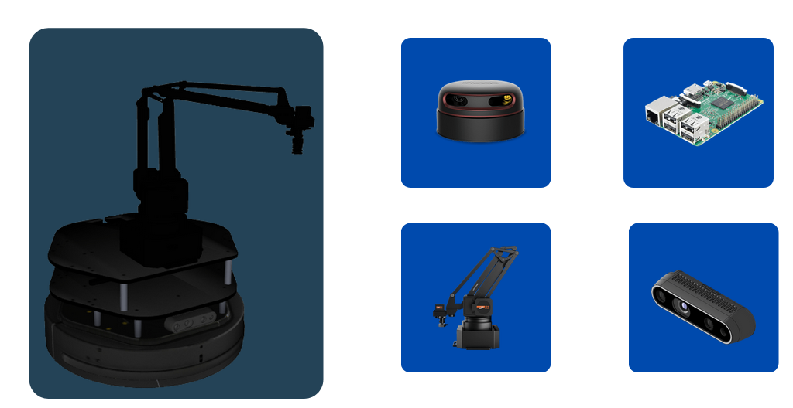
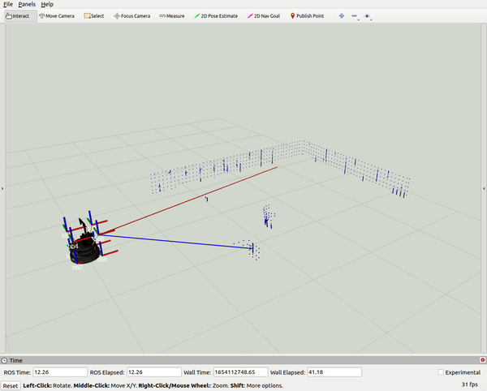
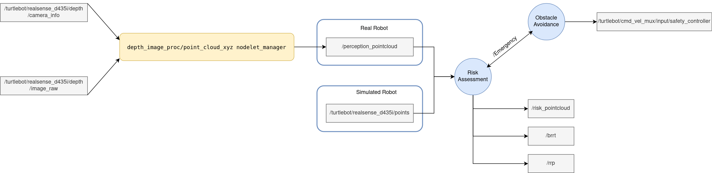

# Pose Based EKF SLAM (PEKSLAM) Using LiDAR Scans and ICP 

**This project belongs to the Universitat de Girona. It is forbidden to publish this project or any derivative work in any public repository.**

Prototype and main components:

<p align="center">

</p>
<figcaption align="center"><b>Figure 1. Turtlebot 2: Robotic Platform for Testing the Algorithm</b></figcaption>
</figure>

The present packages implements Risk Collision Assessment for obstacle avoidance purposes based on pointclouds received from a Time of flight camera, the Intel Realsende D435i shown in Figure 1. The risk is computed for every point based on their distance and the velocity of the mobiile base to analyse the best action to take when getting close to an obstacle. Figure 2 provides a visualization animation showing how the risk increases in some object as the robot apporaches them (the blue color representing low risk).

<p align="center">


</p>
<figcaption align="center"><b> Figure 2. Risk Collision Assessment</b></figcaption>
</figure>

## Team Members:

This project has been carried out by:

* [](https://www.github.com/enriquea52) [Enrique Aleman]
* [Mohammad Alshimmari]


## Code Structure
```bash
├── CMakeLists.txt
├── config
│   └── parameters.yaml
├── docs
│   └── imgs
│       ├── risk.gif
│       ├── software.png
│       └── turtlebot_hardware.png
├── include
│   └── perception
├── launch
│   ├── perception.launch
│   └── simulation.launch
├── libs
│   ├── pcl_utils.cpp
│   ├── pcl_utils.h
│   ├── risk_utils.cpp
│   └── risk_utils.h
├── package.xml
├── README.md
├── scripts
│   ├── bounding_box.py
│   ├── laser_scan_to_point_cloud.py
│   ├── obst_avoidance.py
│   └── proto_files
│       ├── lib_cloud_conversion_between_Open3D_and_ROS.py
│       ├── pc_filter
│       ├── risk_assessment.py
│       ├── server_test.py
│       └── test.py
├── src
│   └── risk_assessment.cpp
└── srv
    └── emergency.srv


```

## Required Packages

To make use of the present package, it is necessary to have the following packages and dependencies installed or install them by running the following commands in the working ROS workspace.

For the real platform
```bash

# Clone required packages
cd ~/catkin_ws/src
git clone https://bitbucket.org/udg_cirs/turtlebot.git # This repository!
git clone https://bitbucket.org/udg_cirs/turtlebot_description.git

#The kobuki mobile base
git clone https://bitbucket.org/udg_cirs/kobuki.git
git clone https://bitbucket.org/udg_cirs/kobuki_description.git
git clone https://bitbucket.org/udg_cirs/yujin_ocs.git

# The manipulator
git clone https://bitbucket.org/udg_cirs/swiftpro.git
git clone https://bitbucket.org/udg_cirs/swiftpro_description.git

# The Lidar
git clone https://github.com/Slamtec/rplidar_ros.git

# Package to transform depth images into pointclouds (fixing a bug form the camera)
git clone https://github.com/ros-perception/image_pipeline.git
```

For the simulated environment

```bash
# Clone required packages
cd ~/catkin_ws/src
git clone https://bitbucket.org/udg_cirs/turtlebot_desktop.git 
git clone https://bitbucket.org/udg_cirs/turtlebot_description.git 

#The kobuki mobile base
git clone https://bitbucket.org/udg_cirs/kobuki_desktop.git
git clone https://bitbucket.org/udg_cirs/kobuki_description.git

# The manipulator
git clone https://bitbucket.org/udg_cirs/swiftpro_desktop.git
git clone https://bitbucket.org/udg_cirs/swiftpro_description.git

# The simulation world
git clone https://bitbucket.org/udg_cirs/small_house_world.git 

# Kobuki mobile base dependencies
git clone https://bitbucket.org/udg_cirs/yujin_ocs.git

# ROS controllers
sudo apt install ros-noetic-ros-control                     
sudo apt install ros-noetic-ros-controllers

# Install xterm terminal emulator
sudo apt-get install -y xterm 


```

## How to use it:

Go to your ROS_workspace/src directory

```bash
  $ cd ~/ROS_workspace/src
```

Clone the project or extact the compressed file in ROS_workspace/src directory 

```bash
  $ git clone https://github.com/enriquea52/Hands-On-Perception.git
```

Go back to ROS_workspace directory

```bash
  $ cd ../
```

Run catkin_make or catkin build

```bash
  $ catkin_make
  $ source ./devel/setup.bash 
```
The package can be run either for a real platform or for a simulated environment, the following are the comands for each case.

* Real Platform
```bash
  $ roslaunch perception perception.launch tbot_name:=turtlebotX
```
Where X can be either 1, 2 or 3
* Simulated Environment

```bash
  $ roslaunch perception simulation.launch
```

## Software Architecture

<p align="center">

</p>
<figcaption align="center"><b>Figure 3. ROS software architecture</b></figcaption>
</figure>

## Video demonstration (Click on video):

<p float="left">

Risk Collision Assessment  (Real System)

[](https://youtu.be/4C_cUBitJYA)

</p>


